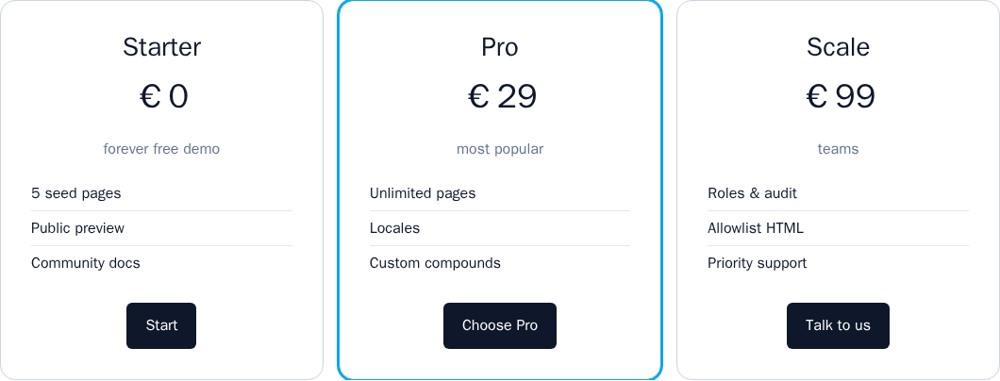
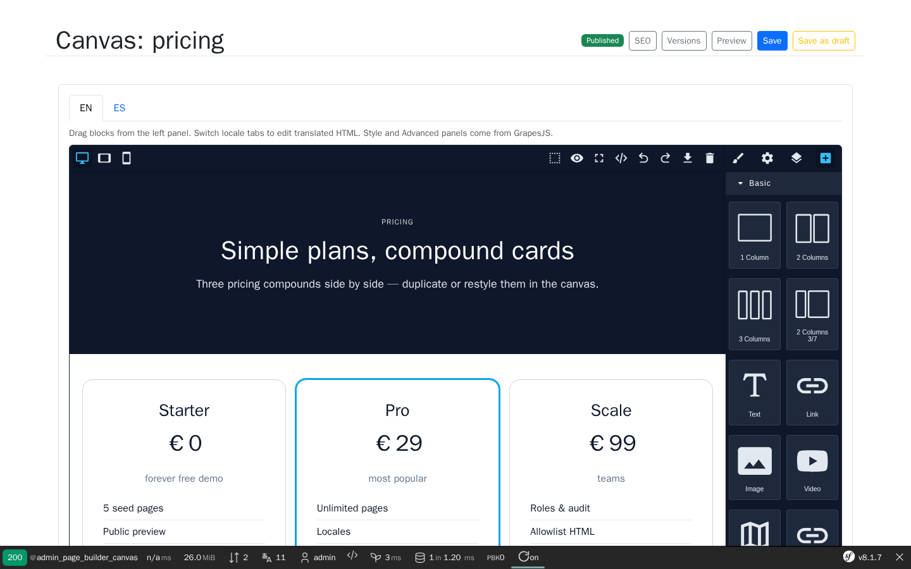

# Page Builder Kit Bundle

[](https://github.com/nowo-tech/PageBuilderKitBundle/actions/workflows/ci.yml) [](https://packagist.org/packages/nowo-tech/page-builder-kit-bundle) [](https://packagist.org/packages/nowo-tech/page-builder-kit-bundle) [](LICENSE) [](https://php.net) [](https://symfony.com) [](https://github.com/nowo-tech/PageBuilderKitBundle) [](#tests-and-coverage)

> ⭐ **Found this useful?** Give it a star on GitHub! It helps us maintain and improve the project.

**Visual Symfony page builder** powered by **GrapesJS**, with Doctrine persistence, locale-aware content, CSRF-protected JSON document API, and Twig-based public rendering. Legacy section/column/widget documents (schema v1) remain supported for read/render.


> Compatible with **Symfony 7.4, 8.0, and 8.1+** on **PHP 8.4+**


This bundle is **FrankenPHP worker mode friendly**. Shared services stay request-safe; optional `BuilderLocales` static binding is cleared after each request. See [FRANKENPHP-WORKER-AUDIT.md](docs/FRANKENPHP-WORKER-AUDIT.md).

<table>
  <tr>
    <td align="center" width="50%">
      
      <br /><sub>Public pricing — full demo context + Web Profiler</sub>
    </td>
    <td align="center" width="50%">
      
      <br /><sub>Admin GrapesJS canvas — context + Web Profiler</sub>
    </td>
  </tr>
</table>


## What is this?

Page Builder Kit Bundle gives Symfony applications a reusable visual page builder backed by Doctrine. Editors create pages with stable keys, compose layouts on a GrapesJS canvas (or classic sections), save locale-specific content, publish or leave as draft, and expose pages on host routes or through Twig helpers. It complements [Page Layout Kit Bundle](https://github.com/nowo-tech/PageLayoutKitBundle) when you need a free-form canvas instead of fixed typed blocks.

## Features

- GrapesJS admin canvas with **preset-webpage** + official plugins, Asset Manager, devices, a11y helpers, and PBK compound blocks
- Legacy schema v1 still supported (**legacy**): sections → columns → widgets (+ Sections editor). Prefer Grapes + content fields for new pages.
- Locale tabs / `localeContent` with default-locale fallback for public render
- Configurable admin mount: `web_ui.path_prefix` (default `/admin/page-builder`)
- Optional `doctrine.table_prefix` for shared databases
- JSON document API (GET/POST), **publish** / **unpublish**, public `/p/{pageKey}`
- Optional **revisions** history (`revisions.enabled`) with restore, diff, templates, duplicate, import/export
- Public **edit pencil** via `nowo_page_builder_can_edit()` + access checker; **draft preview** for editors
- Sandboxed Twig in Grapes HTML; page SEO / Open Graph; asset uploads (local / S3)
- Dev **Web Profiler** panel (`debug.collector`); classic **widget packs** for host extensions
- `DocumentService`, `PageRenderProvider`, Twig `nowo_page_builder_render()`
- Configurable access guard and HTML sanitization
- Symfony 8 FrankenPHP demo in `demo/symfony8` (default port **8137**)

## Quick start

```bash
composer require nowo-tech/page-builder-kit-bundle:^1.0
composer require twig/extra-bundle twig/string-extra
```

```yaml
# config/packages/nowo_page_builder_kit.yaml
nowo_page_builder_kit:
    default_locale: es
    locales: [es, en]
    security:
        access_roles: [ROLE_EDITOR]
```

```yaml
# config/routes/nowo_page_builder_kit.yaml
nowo_page_builder_kit:
    resource: '@NowoPageBuilderKitBundle/Resources/config/routing.yaml'
```

```bash
php bin/console doctrine:migrations:diff
php bin/console doctrine:migrations:migrate
```

Admin: `/admin/page-builder/pages` → open a page canvas.

## Page Layout Kit vs Page Builder Kit

| Topic | [Page Layout Kit](https://github.com/nowo-tech/PageLayoutKitBundle) | Page Builder Kit |
| --- | --- | --- |
| Mental model | Ordered list of **typed blocks** per configured page key | **Tree document**: sections, columns, widgets |
| Block / widget set | Fixed six types (`hero`, `text`, `cards`, …) | Core six widgets; registry open to extensions (Phase 4) |
| Admin UX | Reorder list + inline CMS modals on public pages | Full-page **canvas** with drag-and-drop |
| Page keys | Declared in config (`pages: [home, contact]`) | Created dynamically in admin (unique `pageKey`) |
| Content storage | One entity per block type + translations | Single JSON **structure** + per-locale **widget props** map |
| Public API | `PageBlockProvider::getLayout()` | `PageRenderProvider::getRenderedTree()` / Twig `nowo_page_builder_render()` |
| Best for | Marketing pages with known block patterns | Landing pages and layouts that change shape often |

Use both bundles in one app when some routes need rigid blocks and others need a visual builder.

## Roadmap

| Phase | Status | Scope |
| --- | --- | --- |
| **Phase 1–2** | **Shipped (v1.0.0)** | GrapesJS + classic v1, document API, publish/draft, i18n, SEO/a11y, security, demo |
| **Phase 3** | **Shipped (v1.1.0)** | Revisions + diff, duplicate, import/export, templates library, draft preview |
| **Phase 4** | **Shipped baseline (v1.1.0)** | `WidgetPackInterface`, author guide; classic widget tags |
| **DX** | **Shipped (v1.1.0)** | Web Profiler DataCollector (`debug.collector`) |
| **Follow-ups** | **Shipped (v1.2.0)** | Visual revision diff panels, template JSON sharing, Grapes block packs |
| **Phase 5–7** | **Shipped (v1.4.0)** | Content fields + ACL capabilities, hardening/slots, media library + tags |

Details: [SPEC-DRIVEN-DEVELOPMENT.md](docs/SPEC-DRIVEN-DEVELOPMENT.md#roadmap). Spec Kit: `specs/001`–`008` (docs closure in **v1.1.1**; follow-ups in **v1.2.0**; content/media in **v1.4.0**).

## Development

```bash
make assets                         # pnpm + Vite: TS → src/Resources/public/
make -C demo/symfony8 assets        # Pentatrion Vite: assets/app.ts → public/build/
make -C demo/symfony8 test-e2e
make -C demo/symfony8 demo-screenshots   # refreshes docs/images/demo/*.png
```


```bash
make up
make test
make phpstan
make -C demo/symfony8 up
make demo-smoke
```

Demo default URL: `http://localhost:8137`.

## Documentation

- [Architecture (Mermaid)](docs/ARCHITECTURE.md)
- [Installation](docs/INSTALLATION.md)
- [Configuration](docs/CONFIGURATION.md)
- [Widget authors](docs/WIDGET_AUTHORS.md)
- [Cookbook (packs + templates)](docs/COOKBOOK.md)
- [PSR evaluation (REQ-CS-007)](docs/PSR.md)
- [Usage](docs/USAGE.md)
- [Builder manual](docs/BUILDER-MANUAL.md)
- [Contributing](docs/CONTRIBUTING.md)
- [Code of Conduct](CODE_OF_CONDUCT.md)
- [Changelog](docs/CHANGELOG.md)
- [Upgrading](docs/UPGRADING.md)
- [Release process](docs/RELEASE.md)
- [Security](docs/SECURITY.md)
- [Engram](docs/ENGRAM.md)
- [Spec-driven development](docs/SPEC-DRIVEN-DEVELOPMENT.md)
- [GitHub Spec Kit](docs/SPEC-KIT.md)

### Additional documentation

- [GitHub Actions CI requirements](docs/GITHUB_CI.md)
- [Demo with FrankenPHP](docs/DEMO-FRANKENPHP.md)
- [Use cases matrix](docs/USE-CASES.md)
- [Builder manual](docs/BUILDER-MANUAL.md)
- [FrankenPHP worker mode audit](docs/FRANKENPHP-WORKER-AUDIT.md)

## Tests and coverage

| Area | Status | Command |
| --- | --- | --- |
| PHP `src/` coverage target | ≥90% (CI gate) | `make test-coverage` |
| Unit and bundle QA | Enabled | `make test` |
| Full release checks | Enabled | `make release-check` |

```bash
make test
make test-coverage
make release-check
```

## License

MIT — see [LICENSE](LICENSE).
