# Architecture

Mermaid diagrams for **Page Builder Kit Bundle**. Rendered by GitHub, many IDEs, and Spec Kit docs viewers.

## Table of contents

- [System overview](#system-overview)
- [Doctrine model](#doctrine-model)
- [Document schemas](#document-schemas)
- [Admin edit → public render](#admin-edit--public-render)
- [Draft / publish lifecycle](#draft--publish-lifecycle)
- [Revisions](#revisions)
- [GrapesJS Twig pipeline](#grapesjs-twig-pipeline)
- [Security](#security)
- [Asset upload](#asset-upload)
- [Public routing & i18n](#public-routing--i18n)

---

## System overview

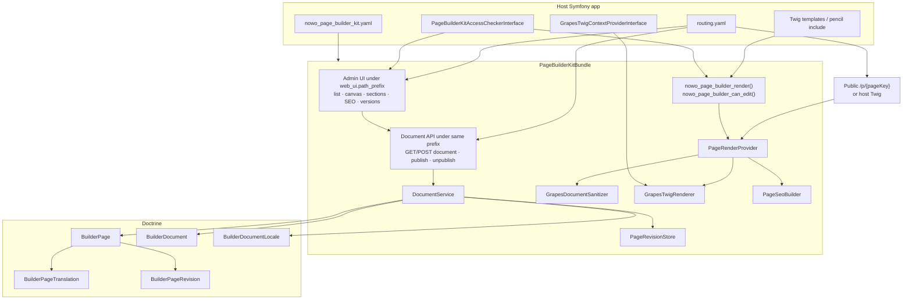

---

## Doctrine model

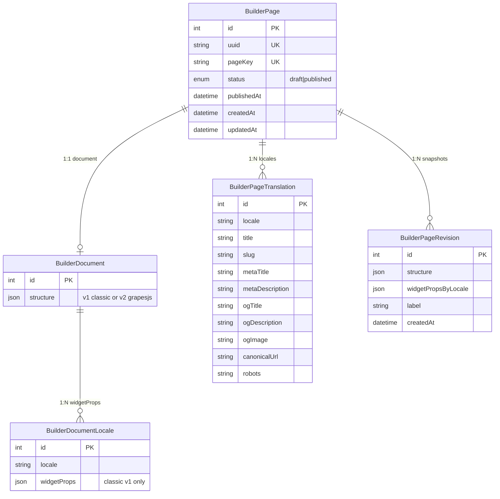

Tables default to `pb_*` (optional `doctrine.table_prefix`).

---

## Document schemas

### Classic schema v1 (sections → columns → widgets)

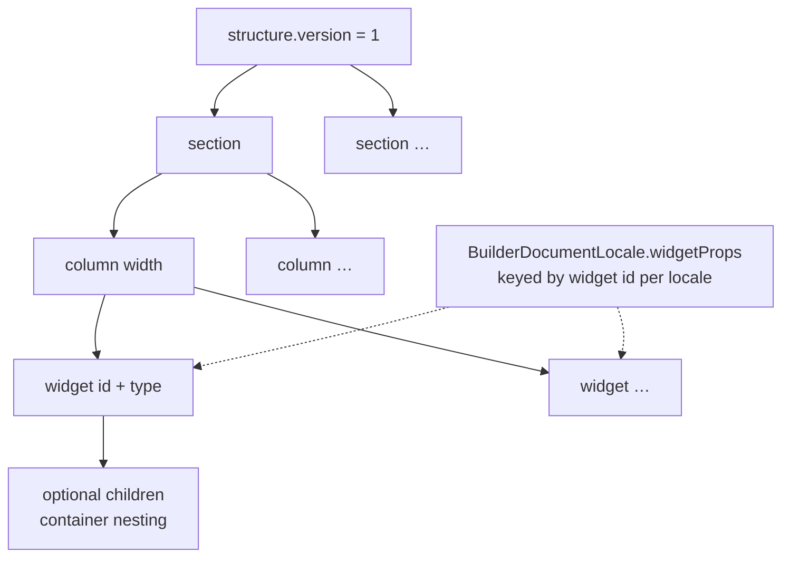

### GrapesJS schema v2

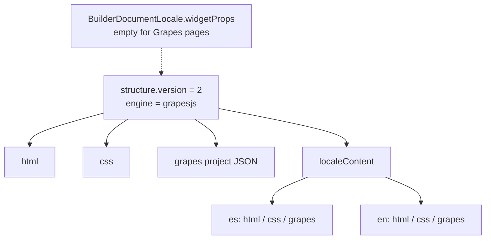

---

## Admin edit → public render

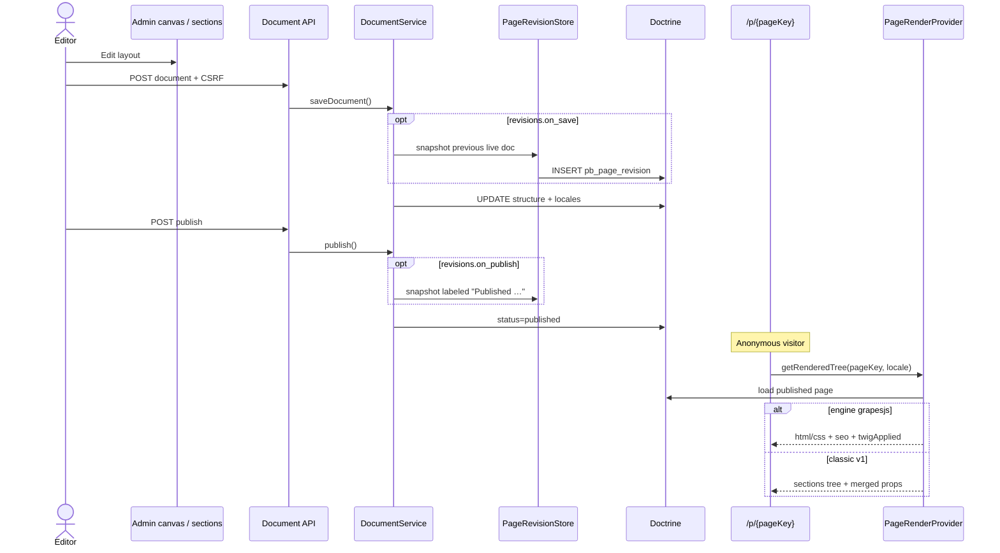

---

## Draft / publish lifecycle

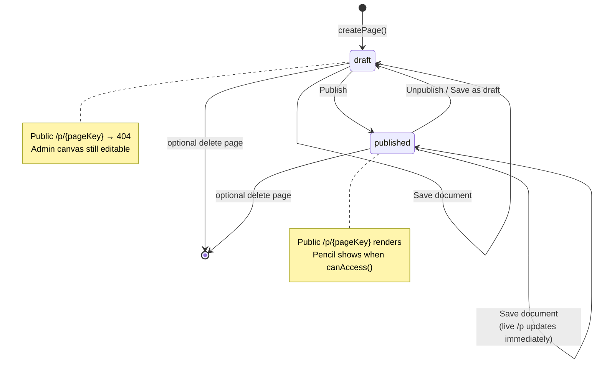

---

## Revisions

Enabled with `revisions.enabled: true`.

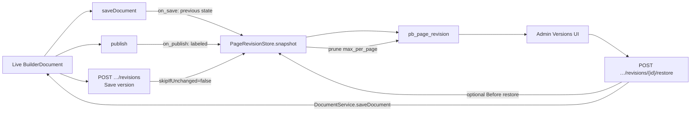

---

## GrapesJS Twig pipeline

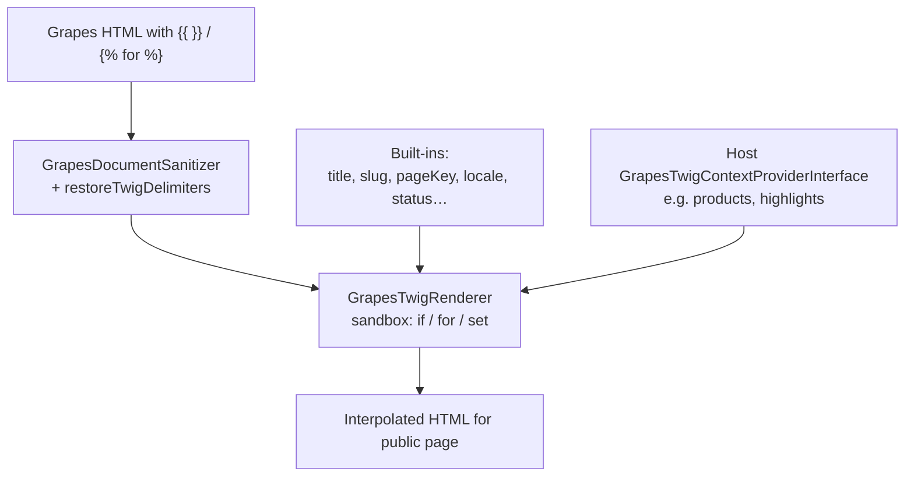

---

## Security

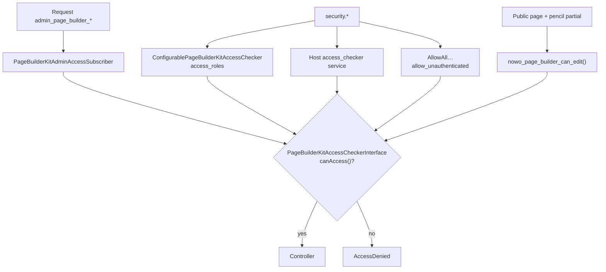

---

## Asset upload

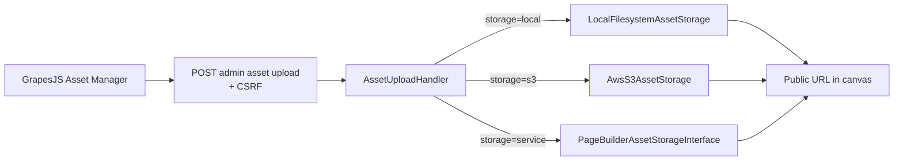

---

## Public routing & i18n

One `BuilderPage` (`pageKey`) holds all locales. **Pretty URLs are host-owned.**

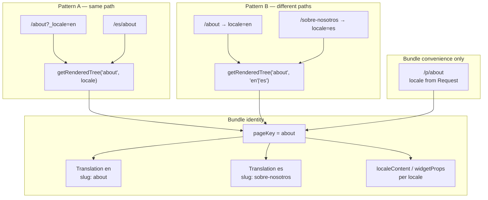

Details and code samples: [USAGE.md — Associating pages with public routes](USAGE.md#associating-pages-with-public-routes-i18n).

## Related docs

- [USAGE.md](USAGE.md) — routes, Twig, i18n URL patterns, revisions, draft/publish
- [CONFIGURATION.md](CONFIGURATION.md) — YAML options
- [SECURITY.md](SECURITY.md) — access and sanitization
- [SPEC-DRIVEN-DEVELOPMENT.md](SPEC-DRIVEN-DEVELOPMENT.md) — phases and REQ anchors
- [USE-CASES.md](USE-CASES.md) — demo matrix
