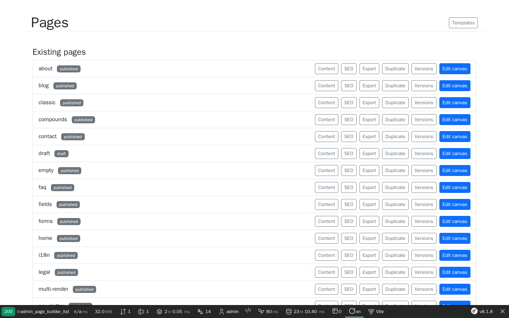
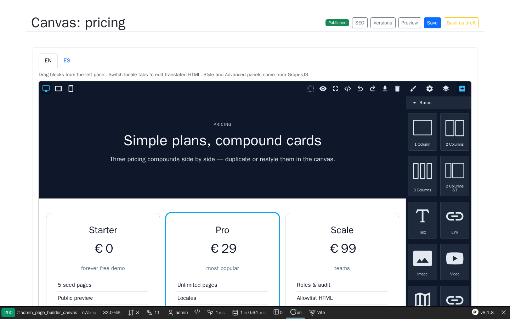
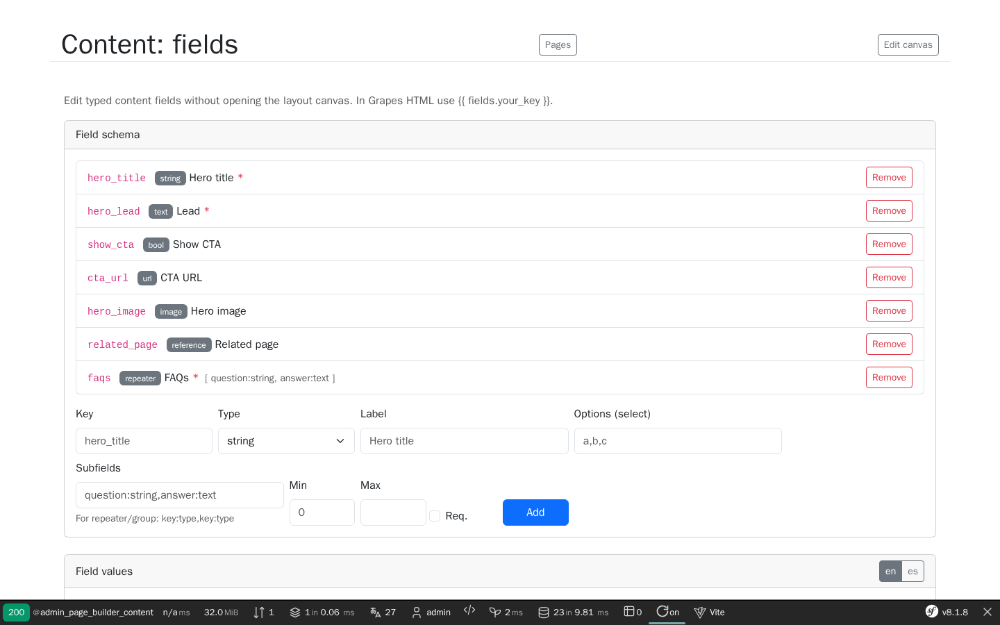
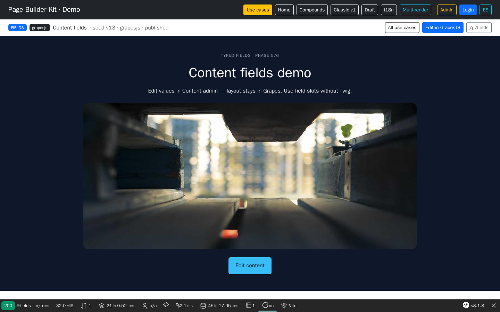
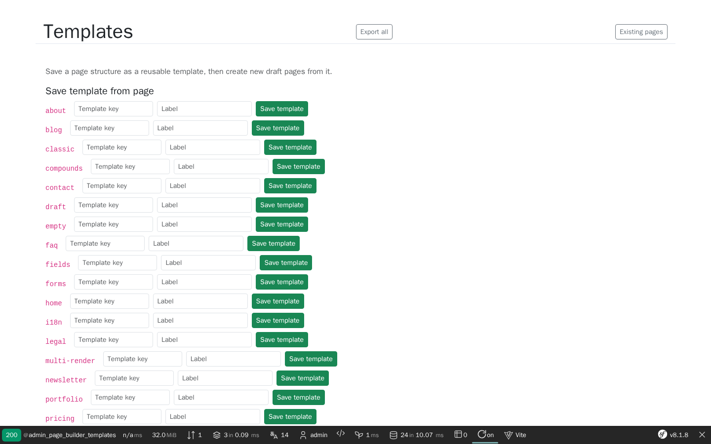
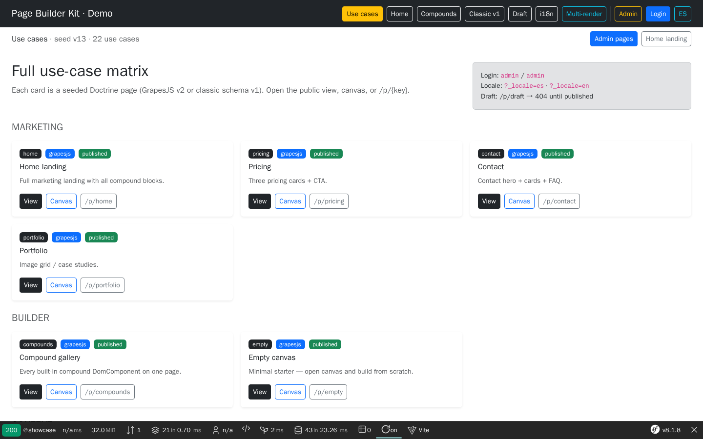

# Builder manual (editor guide)

End-user guide for the Page Builder Kit admin. Screenshots live in [`images/demo/`](images/demo/) and are refreshed with:

```bash
make -C demo/symfony8 demo-screenshots
```

Demo URL: `http://localhost:8137` · Login: `admin` / `admin`

## 1. Open the page list

Go to **Admin → Pages** (`/admin/page-builder/pages`).



From each row you can open **Canvas** (layout), **Content** (typed fields), **Sections** (classic legacy), SEO, revisions, or create from a template.

## 2. Edit layout (Grapes canvas)

Open **Canvas** for a Grapes page (e.g. `/admin/page-builder/pages/pricing/canvas`).



- Drag blocks from the Block Manager (Basic, compounds, **Twig**, **Content fields**, A11y, …).
- Switch locale tabs when the page uses `localeContent`.
- Save (CSRF) · Publish / Unpublish according to your roles.

## 3. Edit typed content (no canvas)

Open **Content** (`/admin/page-builder/pages/{pageKey}/content`).



- **Schema** (layout capability): add fields (`string`, `html`, `repeater`, `reference`, …).
- **Values** (content capability): fill per-locale tabs; labels are also per locale.
- Repeaters: fill the last empty row to add another.
- Images: paste URL or **Upload** when assets upload is enabled.
- References: pick another page key from the select.

## 4. Bind fields in the layout

In the canvas, category **Content fields** inserts samples for this page’s schema.

Public HTML may use:

| Syntax | Needs Twig? | Example |
| --- | --- | --- |
| `[[fields.hero_title]]` | No | Slot (escaped unless html/raw) |
| `{{ fields.hero_title }}` | Yes | Twig sandbox |
| `` | Yes | Repeater loop |

Demo page: [`/fields`](http://localhost:8137/fields) · Content admin: `/admin/page-builder/pages/fields/content`



## 5. Templates

**Templates** admin: save a page as template, then apply with:

- **Copy field schema** (default on)
- **Copy field values** (default off — editors fill fresh content)



## 6. Publish rules

Publishing fails if a **required** field is empty for any configured locale (or a repeater is below `min`). Fix values in Content, then publish again from the canvas.

Draft demo: `/draft` is visible in the app; `/p/draft` returns **404** until published.

## 7. Showcase matrix

All seeded use cases: `/showcase`



See also [USE-CASES.md](USE-CASES.md) for the full capability / demo matrix.
