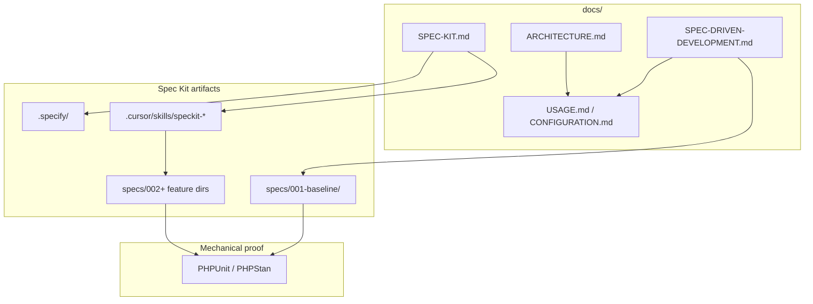

# GitHub Spec Kit — short guide

This bundle uses [GitHub Spec Kit](https://github.com/github/spec-kit) with **Cursor Agent** integration.

## Artifacts

| Path | Role |
| --- | --- |
| `specs/001-baseline/spec.md` | Phase 1 product baseline (`FR-*`, `SC-*`) |
| `specs/001-baseline/code-inventory.md` | Canonical map of every production file under `src/` → requirements (all shipped phases) |
| `specs/002-phase2-grapesjs/spec.md` | Phase 2 GrapesJS canvas / schema v2 (**shipped** v1.0.0) |
| `specs/003-phase3-revisions-templates/spec.md` | Phase 3 revisions, templates, I/O, draft preview (**shipped** v1.1.0) |
| `specs/004-phase4-external-widgets/spec.md` | Phase 4 classic widget packs baseline (**shipped** v1.1.0); Grapes block packs follow-up in **v1.2.0** |
| `specs/005-content-fields-i18n/spec.md` | Phase 5 content fields + capabilities MVP (**shipped** v1.4.0) |
| `specs/006-phase6-content-hardening/spec.md` | Phase 6 composites + publish validation (**shipped** v1.4.0) |
| `specs/007-phase6b-content-wave2/spec.md` | Phase 6b slots + content admin UX (**shipped** v1.4.0) |
| `specs/008-phase7-media-tags-nesting/spec.md` | Phase 7 media library + dynamic tags (**shipped** v1.4.0) |
| `specs/009-product-polish-compliance/spec.md` | Phase 9 polish + org-standards compliance + public HTML normalizer (**shipped** v1.4.1–v1.4.4) |
| `docs/SPEC-DRIVEN-DEVELOPMENT.md` | User stories, scope, roadmap, `REQ-*` anchors |
| `.specify/` | Templates and constitution (after `specify init`) |
| `.cursor/skills/speckit-*/` | Cursor slash commands |

## How the layers fit together



## Maintainer workflow

1. Change code → update the relevant phase spec (`001`–`009`) and the canonical `code-inventory.md` when behavior or files change.
2. Change integrator-visible behavior → update `docs/USAGE.md` / `docs/CONFIGURATION.md` / `docs/ARCHITECTURE.md` / `docs/COOKBOOK.md`.
3. Run `make test`, `make phpstan`, `make release-check` before merge.

## Initialize (once per repo)

```bash
uv tool install specify-cli --from git+https://github.com/github/spec-kit.git
specify init --here --force --integration cursor-agent --script sh
```

Full tooling manual: upstream [Spec Kit documentation](https://github.github.io/spec-kit/) and sibling bundles' `docs/SPEC-KIT.md` for extended checklists.

## See also

- [ARCHITECTURE.md](ARCHITECTURE.md) — Mermaid system / ORM / lifecycle diagrams
- [SPEC-DRIVEN-DEVELOPMENT.md](SPEC-DRIVEN-DEVELOPMENT.md)
- [specs/001-baseline/spec.md](../specs/001-baseline/spec.md)
- [specs/002-phase2-grapesjs/spec.md](../specs/002-phase2-grapesjs/spec.md)
- [specs/003-phase3-revisions-templates/spec.md](../specs/003-phase3-revisions-templates/spec.md)
- [specs/004-phase4-external-widgets/spec.md](../specs/004-phase4-external-widgets/spec.md)
- [specs/005-content-fields-i18n/spec.md](../specs/005-content-fields-i18n/spec.md)
- [specs/008-phase7-media-tags-nesting/spec.md](../specs/008-phase7-media-tags-nesting/spec.md)
- [specs/009-product-polish-compliance/spec.md](../specs/009-product-polish-compliance/spec.md)
