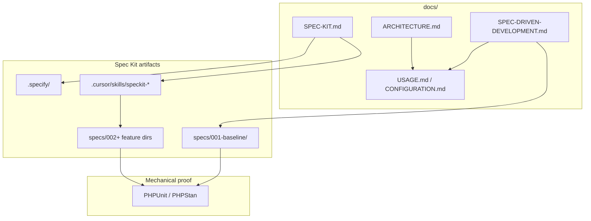

# GitHub Spec Kit — short guide

This bundle uses [GitHub Spec Kit](https://github.com/github/spec-kit) with **Cursor Agent** integration.

## Artifacts

| Path | Role |
| --- | --- |
| `specs/001-baseline/spec.md` | Phase 1 product baseline (`FR-*`, `SC-*`) |
| `specs/001-baseline/code-inventory.md` | Every production file under `src/` mapped to requirements |
| `docs/SPEC-DRIVEN-DEVELOPMENT.md` | User stories, scope, roadmap, `REQ-*` anchors |
| `.specify/` | Templates and constitution (after `specify init`) |
| `.cursor/skills/speckit-*/` | Cursor slash commands |

## How the layers fit together



## Maintainer workflow

1. Change code → update baseline spec + inventory when behavior or files change.
2. Change integrator-visible behavior → update `docs/USAGE.md` / `docs/CONFIGURATION.md` / `docs/ARCHITECTURE.md`.
3. Run `make test`, `make phpstan`, `make release-check` before merge.

## Initialize (once per repo)

```bash
uv tool install specify-cli --from git+https://github.com/github/spec-kit.git
specify init --here --force --integration cursor-agent --script sh
```

Full tooling manual: upstream [Spec Kit documentation](https://github.github.io/spec-kit/) and sibling bundles' `docs/SPEC-KIT.md` for extended checklists.

## See also

- [ARCHITECTURE.md](ARCHITECTURE.md) — Mermaid system / ORM / lifecycle diagrams
- [SPEC-DRIVEN-DEVELOPMENT.md](SPEC-DRIVEN-DEVELOPMENT.md)
- [specs/001-baseline/spec.md](../specs/001-baseline/spec.md)
